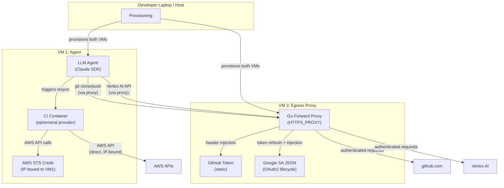
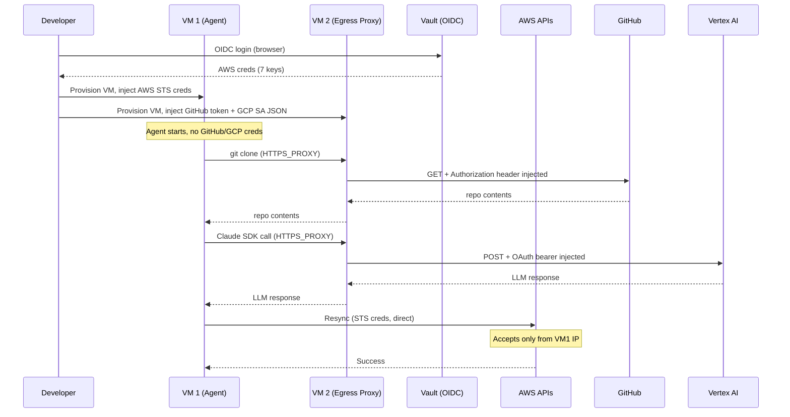

# LLM Agent VM Isolation Architecture

**Last Updated Date**: 2026-04-24

## Summary

The spec-to-pr LLM agent runs in an isolated VM with IP-bound AWS STS credentials and an egress proxy that injects GitHub and Google authentication tokens on behalf of the agent. The agent never directly holds credentials for GitHub or Google, and its AWS credentials are useless outside the VM's IP address.

## Context

- **Problem Statement**: The spec-to-pr agent uses an LLM (Claude SDK via Vertex AI) to autonomously implement, deploy, test, and debug code changes. This agent requires credentials for AWS (ephemeral environment management), GitHub (repository access), and Google Cloud (Vertex AI API access). Unlike a deterministic CI job, an LLM can be prompt-injected or behave unexpectedly, making credential exposure a first-order security concern.
- **Constraints**:
  - The agent must be able to trigger ephemeral environment resyncs, which require AWS credentials with cross-account AssumeRole capability
  - The agent must clone and push to private GitHub repositories
  - The agent must call Vertex AI endpoints using Google service account credentials
  - The ephemeral provider tooling (1,665 lines of Python, boto3, YAML deep-merge, concurrent pipeline polling) is impractical to rewrite
  - The LLM may have access to shell execution tools, making in-process credential isolation ineffective
- **Assumptions**:
  - An attacker's primary goal is credential exfiltration for use outside the agent's environment
  - The LLM will have tool access that includes some form of code/command execution
  - Short-lived, scoped credentials are acceptable for the agent's operational needs
  - The team operates the agent in a monitored, non-production context initially

## Alternatives Considered

1. **Single container with all credentials**: Run the agent in a single container with all credentials as environment variables. Simple to implement but the LLM has direct access to every credential. Any prompt injection or unexpected behavior can exfiltrate all credentials.

2. **Podman-in-podman with privilege separation**: Use podman machine (VM) with nested containers and setuid wrappers to isolate credentials from the LLM process. The LLM calls a privileged wrapper script that reads credentials from a root-owned file. Mitigates direct credential access but adds 3-4 levels of container nesting (host, VM, agent container, CI container, ephemeral containers) which is fragile and largely untested at that depth.

3. **Two-VM architecture with egress proxy (chosen)**: Separate the agent and credential management into two VMs. The agent VM holds only IP-restricted AWS STS credentials. A second VM runs a custom egress proxy that injects authentication for GitHub and Google API traffic. Credentials for GitHub and Google never exist on the agent VM.

4. **NVIDIA OpenShell**: Use NVIDIA's [OpenShell](https://github.com/NVIDIA/OpenShell) sandbox runtime, which provides containerized sandboxes with policy-enforced egress routing. OpenShell uses a mandatory forward proxy with network namespace isolation, seccomp filtering, and OPA policy evaluation. However, its credential injection is limited to static token replacement — it does not support OAuth2 token refresh flows required for Google Vertex AI. Adding this support would require forking the project and maintaining patches upstream acceptance is uncertain.

5. **Fully external orchestration**: Run the LLM agent with no infrastructure credentials at all. A separate system watches for agent requests (via a queue or API) and executes infrastructure operations on its behalf. Maximum isolation but adds significant complexity and latency to the development loop.

6. **AWS credential proxying**: Route AWS API calls through the egress proxy and have it perform SigV4 request signing on behalf of the agent, removing all credentials from the agent VM. Rejected because AWS SigV4 signing requires the proxy to fully parse each request, compute a cryptographic signature over the method, path, headers, query parameters, and body, and handle per-service canonicalization variations. This is effectively reimplementing the AWS SDK's signing logic. IP-bound STS credentials achieve the same anti-exfiltration goal with native IAM support and no custom signing code.

## Design Rationale

- **Justification**: The two-VM architecture provides strong credential isolation without requiring rewrites of existing tooling or deep container nesting. The agent VM runs the existing CI container image with the ephemeral provider baked in, and the egress proxy is a well-understood pattern (similar to OpenShift egress proxy or service mesh credential injection). AWS STS IP-binding is a native IAM feature that requires no custom tooling.

- **Evidence**: AWS IAM `aws:SourceIp` condition keys are a supported, production-grade mechanism for restricting credential usage to specific IP addresses. Egress proxies with credential injection are a standard pattern in zero-trust architectures (Envoy external authorization, AWS VPC endpoint policies, OpenShift egress IP).

- **Comparison**: Alternative 1 (single container) was rejected because the LLM having direct credential access is an unacceptable risk for a non-deterministic system. Alternative 2 (podman nesting) was rejected because 3-4 levels of container nesting is fragile and the storage driver, cgroup delegation, and PID namespace issues at that depth are undocumented. Alternative 4 (OpenShell) was evaluated in detail — its sandbox isolation model (network namespaces, seccomp, OPA policy) is strong, but its credential injection only supports static token replacement and cannot handle OAuth2 token refresh flows needed for Vertex AI. Adding this support would mean maintaining a fork. Alternative 5 (fully external) was rejected as over-engineered for the current stage. Alternative 6 (AWS credential proxying) was rejected because SigV4 signing in a proxy is a significant reimplementation effort with no security benefit over IP-bound STS credentials.

## Design

### Architecture



### Component Details

#### VM 1: Agent

- Runs the LLM agent (Claude SDK via Vertex AI) and the CI container image
- Holds AWS STS credentials scoped with an `aws:SourceIp` condition matching VM 1's IP address
- Routes all GitHub and Google API traffic through VM 2's egress proxy (via `HTTPS_PROXY` environment variable)
- The CI container image (with the ephemeral provider) is baked at build time; the LLM cannot modify it
- No GitHub token or Google service account credentials exist anywhere on this VM

#### VM 2: Egress Proxy

A custom Go forward proxy built specifically for this architecture. Existing solutions (NVIDIA OpenShell, Envoy ext_authz, squid) were evaluated but none support the combination of static token injection and OAuth2 token lifecycle management required.

Go was chosen because:

- The standard library `net/http` provides built-in `CONNECT` tunnel and proxy support
- `golang.org/x/oauth2/google` handles the entire Google service account token lifecycle (JWT signing, token exchange, caching, refresh) out of the box
- Single static binary with no runtime dependencies — trivial to deploy to the proxy VM
- Consistent with the project's primary backend language

The agent VM is configured with `HTTPS_PROXY` pointing at VM 2. All outbound HTTPS traffic is routed through the proxy, which handles `CONNECT` requests and applies credential injection based on the destination domain.

The proxy handles two distinct credential injection patterns:

- **GitHub (static token injection)**: For requests to `github.com` and `api.github.com`, injects `Authorization: Bearer <GITHUB_TOKEN>` header. The token is loaded at proxy startup and does not change during the session.
- **Google Vertex AI (OAuth2 token lifecycle)**: For requests to `*-aiplatform.googleapis.com`, the proxy manages the full OAuth2 flow internally using `golang.org/x/oauth2/google`:
  1. Reads the Google service account JSON at startup
  2. The `oauth2` library handles JWT signing, token exchange via `POST https://oauth2.googleapis.com/token`, caching, and automatic refresh before expiry (tokens are valid for 1 hour)
  3. Injects `Authorization: Bearer <access_token>` into each proxied request

The proxy operates as a TLS-terminating forward proxy (MITM). It generates a CA certificate at startup, which must be trusted by the agent VM. When the agent makes an HTTPS request via `HTTPS_PROXY`, the flow is:

1. Agent sends a `CONNECT <domain>:443` request to the proxy
2. Proxy checks the domain against the allowlist — non-allowlisted domains are rejected here, before TLS
3. Proxy dynamically generates a TLS certificate for the requested domain, signed by its CA
4. Agent validates the certificate — the domain matches and the CA is trusted, so the connection proceeds
5. Proxy decrypts the request, injects credentials, re-encrypts, and forwards to the real destination

This per-domain certificate generation is the standard MITM proxy pattern (used by mitmproxy, Charles Proxy, corporate inspection proxies). During provisioning, `make agent-start` copies the proxy's CA certificate to VM 1 and adds it to the system trust store (`update-ca-trust`), ensuring all clients (Go HTTP, git, Claude SDK) accept the proxy's certificates transparently.

**Domain allowlist:**

- `github.com`
- `api.github.com`
- `*.googleapis.com` (covers Vertex AI and OAuth2 token endpoint)

All proxied requests are logged with timestamp, destination, method, path, and response status for audit. Credential values are never logged.

The proxy accepts inbound connections only from VM 1's IP address.

#### Why AWS Credentials Stay on the Agent VM

Unlike GitHub and Google credentials, AWS API calls cannot be proxied with simple header injection. AWS uses SigV4 signing, where credentials are used to compute a cryptographic signature over the entire request (method, path, headers, query parameters, body). Proxying this would require reimplementing the AWS SDK's signing logic and handling per-service canonicalization differences.

Instead, AWS credentials are held directly on the agent VM but rendered useless outside it via IP-bound STS sessions. This provides the same anti-exfiltration guarantee (stolen creds don't work elsewhere) using a native IAM feature rather than custom proxy code.

#### AWS STS IP Binding

The IAM policy attached to the agent's assumed role includes a source IP condition:

```json
{
  "Version": "2012-10-17",
  "Statement": [
    {
      "Effect": "Deny",
      "Action": "*",
      "Resource": "*",
      "Condition": {
        "NotIpAddress": {
          "aws:SourceIp": "<VM1-IP>/32"
        }
      }
    }
  ]
}
```

This ensures that even if the STS credentials are exfiltrated, they cannot be used from any other IP address.

#### Credential Flow



### Threat Model

| Threat                                      | Mitigated? | Detail                                                                                                                                      |
| ------------------------------------------- | ---------- | ------------------------------------------------------------------------------------------------------------------------------------------- |
| Credential exfiltration (AWS)               | Yes        | STS creds are IP-bound; useless from any other host                                                                                         |
| Credential exfiltration (GitHub)            | Yes        | Token never exists on VM 1; proxy injects it                                                                                                |
| Credential exfiltration (Google)            | Yes        | SA JSON never exists on VM 1; proxy handles OAuth                                                                                           |
| LLM misuses AWS creds from VM 1             | Partially  | STS role should be scoped to minimum actions (resync only); the LLM can still make valid API calls from the VM                              |
| LLM pushes malicious code via GitHub        | Partially  | Proxy logs all requests; branch protection and PR reviews provide a gate; the LLM can push but cannot merge                                 |
| Supply chain via modified workspace         | Partially  | The ephemeral provider is baked into the CI container image and is not mounted from the workspace; the LLM cannot modify the resync tooling |
| Prompt injection causing unintended actions | No         | The LLM can still take actions within its granted access; monitoring and circuit breakers are the mitigation                                |
| Egress proxy compromise                     | No         | If VM 2 is compromised, all credentials are exposed; VM 2 should have no inbound access except from VM 1                                    |

### What This Architecture Does NOT Prevent

The LLM can still perform actions within the scope of its granted access. Specifically:

- It can make AWS API calls (within the STS role's permissions) from VM 1
- It can push code to branches (via the proxy) that could contain malicious content
- It can make Vertex AI calls (via the proxy) to exfiltrate data through the LLM itself

These are mitigated by:

- Scoping the STS role to the minimum required actions
- Branch protection rules requiring review before merge
- Audit logging on the egress proxy
- Circuit breakers in the agent orchestrator (hard limit on iterations, repeated error detection)

## Consequences

### Positive

- Credentials for GitHub and Google never exist on the agent VM, eliminating exfiltration as a threat vector for those services
- AWS credentials are rendered useless if exfiltrated due to IP binding
- The existing ephemeral provider code requires no modifications
- The egress proxy provides a complete audit log of all external API calls made by the agent
- The architecture follows established zero-trust patterns and uses native AWS/proxy capabilities
- Each VM is disposable and can be rebuilt from scratch

### Negative

- Two VMs increases infrastructure complexity and cost compared to a single container
- The egress proxy is custom code that must be built and maintained; existing solutions (OpenShell, Envoy, squid) do not support the required OAuth2 token lifecycle management for Vertex AI
- The proxy requires TLS MITM, which adds a custom CA certificate trust chain to manage
- Vault OIDC login is required at start time (browser-based, cannot be automated for unattended operation)
- STS credentials have a maximum lifetime (12 hours default); the agent VM must be recycled when they expire
- Network latency between VM 1 and VM 2 adds overhead to every GitHub and Vertex AI call
- The developer must manage two VMs instead of one container

## Cross-Cutting Concerns

### Security

- AWS STS credentials should use the shortest practical session duration to limit the window of misuse
- The STS role's IAM policy should follow least privilege: only the actions needed for ephemeral environment resync
- The proxy generates a CA certificate at startup for TLS MITM; this CA must be injected into the agent VM's trust store during provisioning. The CA private key exists only on VM 2
- Non-allowlisted destinations are rejected at the `CONNECT` stage before TLS is established, minimising the MITM surface
- VM 2 should accept connections only from VM 1's IP address (security group / firewall rule)
- The domain allowlist should be as narrow as possible: `github.com`, `api.github.com`, `*.googleapis.com`
- Audit logs from the proxy should be shipped to a central logging system, not stored only on VM 2

### Cost

- Two VMs vs one container increases compute cost; for local development, this means two QEMU VMs on the developer's laptop
- For CI/automated use, this could run on two small EC2 instances (e.g., `t3.medium` for the proxy, larger for the agent)
- STS credential recycling means VM rebuilds, but the VMs are designed to be disposable and fast to provision

### Operability

- Both VMs should be provisionable with a single command, handling vault login, networking, CA trust injection, and proxy startup
- The VM tooling must work on both macOS (Apple Silicon) and Linux; Vagrant with QEMU is the preferred approach
- The proxy VM is largely static and could be left running across multiple agent sessions
- The Go proxy is a single static binary with no runtime dependencies, simplifying deployment and updates
- Health checks should verify: proxy reachability from VM 1, STS credential validity, GitHub/Google API connectivity through proxy
- Both VMs should be disposable and fast to rebuild from scratch
