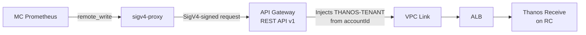

# Management Cluster Metrics Pipeline via Remote Write

**Last Updated Date**: 2026-03-31

## Summary

Management Cluster (MC) Prometheus instances forward metrics to the Regional Cluster (RC) Thanos Receive via Prometheus remote_write, using an aws-sigv4-proxy sidecar for SigV4 authentication and a REST API Gateway for cross-account access control and tenant isolation.

## Context

- **Problem Statement**: MC Prometheus metrics must be centralized in the RC for cross-cluster observability, but MCs run in separate AWS accounts with no direct network path to the RC. The solution must authenticate cross-account requests and enforce tenant isolation so that one MC cannot write metrics under another MC's identity.
- **Constraints**: MCs have no network path to the RC Kubernetes API. Cross-account IAM authentication is required. Tenant identity must be server-side enforced (not client-asserted). The Prometheus remote_write protocol uses snappy-compressed protobuf with `Content-Encoding: snappy`.
- **Assumptions**: Each MC runs in a dedicated AWS account. The RC operates a REST API Gateway with VPC Link to internal ALBs. EKS Pod Identity provides IAM credentials to MC workloads.

## Architecture



### Data Flow

1. **MC Prometheus** sends snappy-compressed protobuf to the sigv4-proxy service via `remote_write`
2. **sigv4-proxy** strips the `Content-Encoding` header, signs the request with SigV4 using Pod Identity credentials, and forwards to the API Gateway
3. **API Gateway** (REST API v1) authenticates the request via AWS_IAM, evaluates the resource policy for cross-account access, and injects the `THANOS-TENANT` header from `context.identity.accountId`
4. **Thanos Receive** ingests metrics under the tenant ID (MC account ID), storing them in a per-tenant TSDB

### Tenant Isolation

The API Gateway HTTP (non-proxy) integration maps the `THANOS-TENANT` header server-side via request parameter mapping:

```hcl
request_parameters = {
  "integration.request.header.THANOS-TENANT" = "context.identity.accountId"
}
```

This ensures the tenant identity comes from the verified SigV4 caller identity, not from client-supplied headers. Using HTTP integration (not HTTP_PROXY) means API Gateway overwrites any client-supplied `THANOS-TENANT` header. A compromised MC cannot write metrics under another MC's tenant ID.

## Alternatives Considered

1. **HTTP API v2 Gateway**: Passes all content natively (no Content-Encoding validation), confirmed working with snappy payloads. However, HTTP API v2 does not support resource policies, making cross-account IAM auth impractical without per-MC role assumption.

2. **Direct VPC peering MC to RC**: Would allow Prometheus to write directly to Thanos Receive. Rejected because it creates a network path from MC to RC (violating the isolation model) and provides no server-side tenant enforcement.

3. **Prometheus native SigV4 support**: The Prometheus operator CRD exposes `sigv4` configuration, but `sigv4.serviceName` defaults to `aps` (Amazon Managed Prometheus) and cannot be set to `execute-api`. Workaround: use an explicit sigv4-proxy sidecar.

## Design Rationale

- **Justification**: REST API v1 with sigv4-proxy provides cross-account IAM auth (via resource policies), server-side tenant injection, and binary payload support — all required for secure multi-tenant metrics ingestion.
- **Comparison**: HTTP API v2 was tested and confirmed working for payload delivery, but rejected due to the cross-account auth gap. Direct VPC peering was rejected for security reasons.

## Key Implementation Details

### sigv4-proxy Configuration

```yaml
args:
  - --name
  - execute-api
  - --region
  - { { .Values.global.aws_region } }
  - --host
  - { { API_GATEWAY_HOST } }
  - --port
  - ":8005"
  - --strip
  - Content-Encoding
```

Critical flags:

- **`--strip Content-Encoding`**: Removes the `Content-Encoding: snappy` header before signing. REST API v1 only accepts `gzip`, `deflate`, and `identity` as Content-Encoding values (returns 415 otherwise). Stripping is semantically correct because snappy compression is part of the Prometheus remote_write application protocol, not HTTP transport-level compression. Thanos Receive always expects snappy-compressed protobuf regardless of headers.
- **No `--unsigned-payload`**: REST API v1 requires the payload hash in the SigV4 signature. Using `UNSIGNED-PAYLOAD` causes a signature mismatch (403). Signed payloads also provide integrity verification as a security benefit.
- **`--name execute-api`**: Sets the AWS service name for SigV4 signing (required for API Gateway).

### Remote Write URL

The remote_write URL must include the API Gateway stage prefix:

```yaml
remoteWrite:
  - url: "http://sigv4-proxy.monitoring.svc:8005/prod/api/v1/receive"
```

The `/prod` stage prefix is required because the sigv4-proxy forwards the path as-is to the API Gateway.

### API Gateway Configuration

- **Binary media types**: `application/x-protobuf` configured to pass binary payloads through without text encoding
- **Resource policy**: Allows `execute-api:Invoke` from specific MC account IDs
- **Redeployment trigger**: API Gateway must be redeployed when `binary_media_types` changes

## Consequences

### Positive

- Server-side tenant isolation prevents MC tenant spoofing
- Cross-account access is controlled via API Gateway resource policy (add/remove MC accounts declaratively)
- Signed payloads provide end-to-end integrity verification
- No direct network path from MC to RC — all traffic flows through API Gateway
- Standard Prometheus remote_write protocol — no custom agents or exporters needed

### Negative

- sigv4-proxy adds a hop and must hash every payload (CPU overhead proportional to payload size)
- REST API v1 has a 10MB payload limit (sufficient for Prometheus batches of ~2000 samples)
- Adding a new MC requires updating the API Gateway resource policy with the new account ID
- `Content-Encoding: snappy` stripping is a workaround for an API GW v1 limitation — if AWS adds snappy support or we move to HTTP API v2 with cross-account auth, this can be removed

## Cross-Cutting Concerns

### Security

- **Authentication**: AWS IAM SigV4 via EKS Pod Identity credentials — no static credentials
- **Authorization**: API Gateway resource policy restricts access to known MC accounts
- **Tenant isolation**: Server-side `THANOS-TENANT` injection from verified caller identity
- **Payload integrity**: Signed payloads prevent tampering in transit
- **Network isolation**: No direct MC-to-RC network path; all traffic through API Gateway

### Performance

- Batch duration ~25ms for 2000-sample batches through the full pipeline
- sigv4-proxy payload hashing adds minimal overhead for typical Prometheus batch sizes
- REST API v1 has a 29-second integration timeout (sufficient for write operations)

### Operability

- sigv4-proxy supports `-v` (verbose) flag for request-level logging including signing details; disabled by default for production. Alternative debugging via API Gateway execution logs or Prometheus remote_storage metrics
- Key Prometheus metrics for monitoring: `prometheus_remote_storage_samples_total`, `prometheus_remote_storage_samples_failed_total`, `prometheus_remote_storage_sent_batch_duration_seconds`
- Thanos Receive creates per-tenant TSDB directories under `/var/thanos/receive/{account_id}/`
