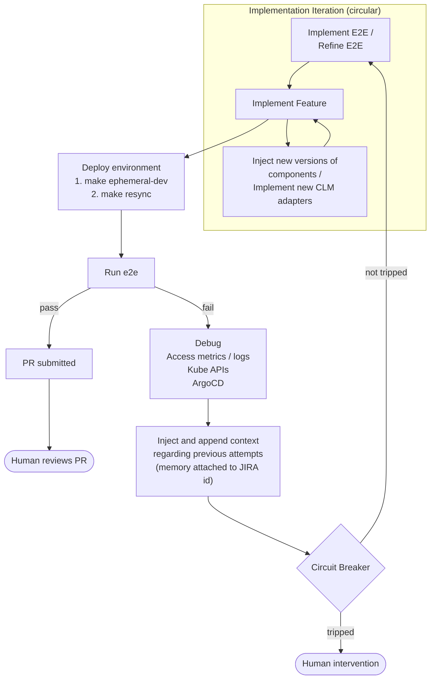

# Spec-to-PR Agent Workflow

```mermaid
flowchart TD
    subgraph ImplementLoop["Implementation Iteration (circular)"]
        E2E["Implement E2E /\nRefine E2E"]
        Feature["Implement Feature"]
        Inject["Inject new versions of\ncomponents /\nImplement new CLM adapters"]
    end

    E2E --> Feature
    Feature --> Inject
    Inject --> Feature

    Feature --> Deploy["Deploy environment\n1. make ephemeral-dev\n2. make resync"]
    Deploy --> RunE2E["Run e2e"]

    RunE2E -- "pass" --> PR["PR submitted"]
    PR --> Human2(["Human reviews PR"])

    RunE2E -- "fail" --> Debug["Debug\nAccess metrics / logs\nKube APIs\nArgoCD"]
    Debug --> Context["Inject and append context\nregarding previous attempts\n(memory attached to JIRA id)"]
    Context --> CircuitBreaker{"Circuit Breaker"}

    CircuitBreaker -- "not tripped" --> E2E
    CircuitBreaker -- "tripped" --> Human1(["Human intervention"])
```
