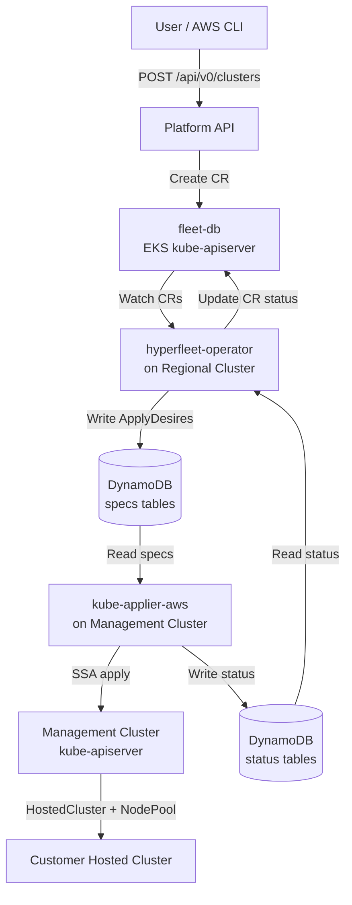

# Hyperfleet-Operator Design

> Replace hyperfleet-api, hyperfleet-sentinel, hyperfleet-adapter, and Maestro with a
> Kubernetes-native operator backed by a kube-apiserver database cluster and DynamoDB-based
> resource distribution.

**Status:** Design
**Authors:** Claudio Busse
**Date:** 2026-06-24

---

## Problem Statement

The current cluster lifecycle stack has five moving parts:

1. **hyperfleet-api** — REST API with PostgreSQL backend (Cluster, NodePool, AdapterStatus CRUD)
2. **hyperfleet-sentinel** — polls hyperfleet-api every 5s, evaluates CEL decision rules, publishes CloudEvents to RabbitMQ
3. **hyperfleet-adapter** — consumes CloudEvents, runs a 4-phase pipeline (params → preconditions → resources → status), creates ManifestWorks via Maestro
4. **Maestro** — MQTT-based (AWS IoT Core) distribution of ManifestWorks from the Regional Cluster to Management Clusters via maestro-agent
5. **rosa-regional-platform-api** — user-facing HTTP API that proxies to hyperfleet-api and Maestro

A single cluster creation request traverses all five components before resources appear on
a management cluster. Each component introduces its own failure modes, operational overhead,
and debugging surface area.

## Solution

Collapse the stack into a Kubernetes-native architecture:



### Components

| Component                      | Role                                                                                                                                                  | Replaces                                                  |
| ------------------------------ | ----------------------------------------------------------------------------------------------------------------------------------------------------- | --------------------------------------------------------- |
| **fleet-db**                   | Workerless EKS cluster; kube-apiserver is the database. CRDs define the schema, CRs are the data.                                                     | PostgreSQL + hyperfleet-api                               |
| **hyperfleet-operator**        | controller-runtime operator on the RC; watches fleet-db CRDs, writes DynamoDB desires, reads status. Three controllers: Cluster, NodePool, Placement. | hyperfleet-sentinel + hyperfleet-adapter + Maestro server |
| **kube-applier-aws**           | Already built. Runs on each MC, reads DynamoDB specs tables, applies via SSA, writes status back.                                                     | Maestro agent                                             |
| **DynamoDB**                   | 6 tables per MC (specs + status for apply/delete/read desires). Already designed in kube-applier-aws.                                                 | MQTT (AWS IoT Core) + RabbitMQ                            |
| **rosa-regional-platform-api** | User-facing API; creates CRs on fleet-db via kube client instead of HTTP calls.                                                                       | Itself (same binary, new backend)                         |

### What Gets Eliminated

- PostgreSQL (hyperfleet-api database)
- RabbitMQ (sentinel → adapter event bus)
- Maestro server + agent (MQTT resource distribution)
- hyperfleet-api (REST API service)
- hyperfleet-sentinel (polling + CEL decision engine)
- hyperfleet-adapter (CloudEvent pipeline)

---

## CRD Definitions

API group: `hyperfleet.io`, version: `v1alpha1`. All CRDs are **cluster-scoped** (the
fleet-db is a dedicated cluster, not shared).

### Cluster

Resource: `clusters.hyperfleet.io`

Replaces the hyperfleet-api `Cluster` model. Typed spec fields derived from the current
adapter task config (`adapter-task-config.yaml`) and manifestwork template.

```yaml
apiVersion: hyperfleet.io/v1alpha1
kind: Cluster
metadata:
  name: <cluster-id> # UUID, globally unique
  labels:
    hyperfleet.io/account-id: "123456789012"
spec:
  name: my-cluster # Display name, 3-53 chars
  accountId: "123456789012"
  region: us-east-1
  zone: us-east-1a
  baseDomain: rosa.example.com
  vpcId: vpc-abc123
  privateSubnetIds: subnet-abc123
  workerInstanceProfileName: worker-profile
  workerSecurityGroupId: sg-abc123
  release:
    image: quay.io/openshift-release-dev/ocp-release:5.0.0-ec.2-multi
  networking:
    clusterNetwork:
      - cidr: 10.132.0.0/14
    serviceNetwork:
      - cidr: 172.31.0.0/16
    machineNetwork:
      - cidr: 10.0.0.0/16
  platform:
    aws:
      roles:
        controlPlaneOperatorARN: arn:aws:iam::role/cpo
        ingressARN: arn:aws:iam::role/ingress
        imageRegistryARN: arn:aws:iam::role/registry
        kubeCloudControllerARN: arn:aws:iam::role/ccm
        nodePoolManagementARN: arn:aws:iam::role/npm
        networkARN: arn:aws:iam::role/network
        storageARN: arn:aws:iam::role/storage
  creatorARN: arn:aws:iam::user/admin # Optional
  deletionRequested: false
status:
  conditions:
    - type: Applied
      status: "True"
    - type: Available
      status: "True"
    - type: Health
      status: "True"
    - type: Ready
      status: "True"
    - type: Reconciled
      status: "True"
  phase: Available
  controlPlaneEndpoint: api.my-cluster.abcd.rosa.example.com
  version: 5.0.0-ec.2
  placementRef:
    name: my-cluster
    managementCluster: mc01
  observedGeneration: 1
```

### NodePool

Resource: `nodepools.hyperfleet.io`

```yaml
apiVersion: hyperfleet.io/v1alpha1
kind: NodePool
metadata:
  name: <nodepool-id>
spec:
  clusterRef: <cluster-id> # References a Cluster CR by name
  replicas: 2
  management:
    autoRepair: true
    upgradeType: Replace
  release:
    image: quay.io/openshift-release-dev/ocp-release:4.21.1-multi
  platform:
    aws:
      instanceType: m6a.xlarge
      rootVolume:
        size: 120
        type: gp3
      subnetId: subnet-abc123
      instanceProfile: worker-profile
      securityGroups:
        - sg-abc123
status:
  conditions:
    - type: Ready
      status: "True"
  phase: Ready
  observedGeneration: 1
```

### Placement

Resource: `placements.hyperfleet.io`

Gates cluster resource creation. The placement controller creates this CR; the cluster
controller waits for it before writing DynamoDB desires.

```yaml
apiVersion: hyperfleet.io/v1alpha1
kind: Placement
metadata:
  name: <cluster-id> # Same name as the Cluster CR
spec:
  clusterRef: <cluster-id>
  managementCluster: mc01 # Hardcoded for now
status:
  conditions:
    - type: Bound
      status: "True"
  phase: Bound
  observedGeneration: 1
```

---

## Controller Design

### Multi-Cluster Client Setup

The operator runs on the Regional Cluster but watches CRs on fleet-db. This uses the
controller-runtime multi-cluster pattern:

1. Standard `ctrl.Manager` on the RC (leader election, health endpoints, metrics)
2. Separate `cache.Cache` + `client.Client` for fleet-db, loaded from a kubeconfig Secret
3. Fleet-db cache added to the manager via `mgr.Add()`
4. Controllers use `source.Kind(fleetDBCache, &v1alpha1.Cluster{})` for watches

This is the same pattern used by Cluster API and Open Cluster Management.

```go
// Simplified setup in cmd/main.go
fleetDBConfig, _ := clientcmd.BuildConfigFromFlags("", fleetDBKubeconfigPath)
fleetDBCache, _ := cache.New(fleetDBConfig, cache.Options{Scheme: scheme})
fleetDBClient, _ := client.New(fleetDBConfig, client.Options{Scheme: scheme})
mgr.Add(fleetDBCache)

ctrl.NewControllerManagedBy(mgr).
    Named("cluster").
    WatchesRawSource(source.Kind(fleetDBCache, &v1alpha1.Cluster{},
        &handler.EnqueueRequestForObject{})).
    Complete(&ClusterReconciler{fleetDBClient: fleetDBClient, dynamoClient: ddb})
```

### Placement Controller

The simplest controller. Implements first to prove the multi-cluster watch pattern.

```
Reconcile(Cluster CR):
  1. Get Cluster CR from fleet-db
  2. List Placements where spec.clusterRef == cluster.Name
  3. If Placement already exists → return
  4. Create Placement CR:
     - name = cluster.Name
     - spec.clusterRef = cluster.Name
     - spec.managementCluster = "mc01" (hardcoded)
  5. Set Placement status phase = "Bound"
```

### Cluster Controller

Core controller. Replaces the hyperfleet-adapter's 4-phase pipeline with a standard
Kubernetes reconcile loop.

```
Reconcile(Cluster CR):
  1. Get Cluster CR from fleet-db
     - Not found → return (deleted externally)
     - DeletionRequested or deletionTimestamp → run deletion flow

  2. Ensure finalizer "hyperfleet.io/operator"

  3. Look up Placement for this cluster
     - No Placement → set status WaitingForPlacement, requeue 10s

  4. Placement not Bound → requeue 10s

  5. Update Cluster.Status.PlacementRef

  6. Generate 7 Kubernetes manifests (Go structs, json.Marshal):
     a. Namespace:       clusters-{clusterId}
     b. ConfigMap:       cluster-config
     c. ConfigMap:       aws-iam-auth-config (with creatorARN user mapping)
     d. ExternalSecret:  pull-secret (references ClusterSecretStore)
     e. Certificate:     api-serving-cert (cert-manager, Let's Encrypt)
     f. HostedCluster:   hypershift.openshift.io/v1beta1 (full spec)
     g. Secret:          ssh-key (placeholder)

  7. For each manifest:
     - Compute documentID = desireid.NewDocumentID(taskKey, GVR, namespace, name)
     - Build ApplyDesire with Spec.ManagementCluster, Spec.KubeContent
     - Upsert to DynamoDB mc-{mc}-specs-applydesires table

  8. Create ReadDesire for HostedCluster status feedback:
     - Targets hypershift.openshift.io/v1beta1/hostedclusters
     - kube-applier mirrors the live HostedCluster object back to DynamoDB

  9. Read status from DynamoDB:
     - ApplyDesire statuses → map to Cluster "Applied" condition
     - ReadDesire status → parse HostedCluster conditions:
       - .status.conditions[type=Available]
       - .status.conditions[type=Degraded]
       - .status.controlPlaneEndpoint.host
       - .status.version.history[0].version

  10. Update Cluster CR status on fleet-db

  11. Requeue after 30s for periodic status refresh

  Deletion flow:
  a. Create DeleteDesires for all cluster resources
  b. Read DeleteDesire statuses → all confirmed deleted?
  c. If yes, remove finalizer from Cluster CR
```

### NodePool Controller

```
Reconcile(NodePool CR):
  1. Get NodePool CR from fleet-db
  2. Look up parent Cluster CR (via spec.clusterRef)
  3. Look up Placement for the cluster → get target MC
     - No Placement or not Bound → requeue
  4. Generate HyperShift NodePool manifest
  5. Create ApplyDesire in DynamoDB
  6. Create ReadDesire for NodePool status (Ready condition)
  7. Read status from DynamoDB, update NodePool CR status
  8. Requeue after 30s
```

---

## DynamoDB Integration

### Operator as the Inverse of kube-applier-aws

|                      | Specs tables | Status tables |
| -------------------- | ------------ | ------------- |
| **Operator**         | Writes       | Reads         |
| **kube-applier-aws** | Reads        | Writes        |

### Tables per Management Cluster

```
mc-{mc}-specs-applydesires    (operator writes, kube-applier reads)
mc-{mc}-specs-deletedesires   (operator writes, kube-applier reads)
mc-{mc}-specs-readdesires     (operator writes, kube-applier reads)
mc-{mc}-status-applydesires   (kube-applier writes, operator reads)
mc-{mc}-status-deletedesires  (kube-applier writes, operator reads)
mc-{mc}-status-readdesires    (kube-applier writes, operator reads)
```

### Document ID Generation

Deterministic UUID v5, shared namespace with kube-applier-aws:

```go
NamespaceUUID = "a3f1b2c4-d5e6-4f7a-8b9c-0d1e2f3a4b5c"
documentID = uuid.NewSHA1(NamespaceUUID, "{taskKey}/{group}/{version}/{resource}/{namespace}/{name}")
```

### ApplyDesire Structure

```go
type ApplyDesire struct {
    DynamoDBMetadata  // DocumentID, Version, CreateTime, UpdateTime
    Spec struct {
        ManagementCluster string                // "mc01"
        ClusterID         string                // Cluster CR name
        NodePoolName      string                // Optional
        TargetItem        ResourceReference     // {Group, Version, Resource, Namespace, Name}
        KubeContent       *runtime.RawExtension // JSON-encoded manifest
    }
    Status struct {
        Conditions                []metav1.Condition
        ObservedDesireUpdateTime  time.Time
        AppliedResourceGeneration int64
    }
}
```

---

## Manifest Generation

The `internal/manifest/` package generates the same Kubernetes resources as the current
`manifestwork.yaml` template, but using Go structs and `json.Marshal` instead of text
templates.

### Resources Created on MC for a Cluster

| #   | Kind           | Name                   | Namespace              | Source   |
| --- | -------------- | ---------------------- | ---------------------- | -------- |
| 1   | Namespace      | `clusters-{clusterId}` | (cluster-scoped)       | Operator |
| 2   | ConfigMap      | `cluster-config`       | `clusters-{clusterId}` | Operator |
| 3   | ConfigMap      | `aws-iam-auth-config`  | `clusters-{clusterId}` | Operator |
| 4   | ExternalSecret | `pull-secret`          | `clusters-{clusterId}` | Operator |
| 5   | Certificate    | `api-serving-cert`     | `clusters-{clusterId}` | Operator |
| 6   | HostedCluster  | `{clusterName}`        | `clusters-{clusterId}` | Operator |
| 7   | Secret         | `ssh-key`              | `clusters-{clusterId}` | Operator |

### Resources Created on MC for a NodePool

| #   | Kind     | Name                           | Namespace              |
| --- | -------- | ------------------------------ | ---------------------- |
| 1   | NodePool | `{clusterName}-{nodepoolName}` | `clusters-{clusterId}` |

### DNS Hash

The current `hash4` (`printf "%.4s" .clusterId`) maps to `clusterId[:4]` in Go (with
bounds checking). This is used for DNS: `api.{name}.{hash4}.{baseDomain}`.

---

## Infrastructure Changes (rosa-regional-platform)

### Fleet-DB EKS Cluster

Provisioned inline in `terraform/config/regional-cluster/main.tf` as a second EKS cluster
sharing the regional VPC.

- Reuses `modules/eks-cluster` with `cluster_type = "fleet-db"`, `cluster_id = "${regional_id}-fleet-db"`
- Shares the RC's VPC, subnets, NAT gateways, and VPC endpoints
- Has its own cluster security group for isolation
- No worker node scheduling (system node pool runs for coredns)
- Fully private, same as the regional cluster
- Supports future sharding — additional fleet-db clusters are additional module calls in the same VPC

### DynamoDB Tables

New Terraform module: `terraform/modules/kube-applier-dynamodb/`

- Creates 6 tables per MC
- On-demand billing, KMS encryption, PITR enabled
- DynamoDB Streams on specs tables (`NEW_AND_OLD_IMAGES`)

### IAM

- **Operator pod identity**: write to `specs-*`, read from `status-*`, EKS access to fleet-db
- **kube-applier-aws pod identity**: read from `specs-*`, write to `status-*`
- **Platform API pod identity**: EKS access to fleet-db (create/read/update CRs)

### ArgoCD

- New chart: `argocd/config/regional-cluster/hyperfleet-operator-chart/`
- CRDs are installed on fleet-db by the operator at startup

---

## Platform API Changes (rosa-regional-platform-api)

### New Fleet-DB Client

Replace `pkg/clients/hyperfleet/client.go` (HTTP REST) with `pkg/clients/fleetdb/client.go`
(controller-runtime kube client):

| Operation | Current (HTTP)                               | New (kube client)                           |
| --------- | -------------------------------------------- | ------------------------------------------- |
| Create    | `POST /api/hyperfleet/v1/clusters`           | `client.Create(ctx, &Cluster{})`            |
| Get       | `GET /api/hyperfleet/v1/clusters/{id}`       | `client.Get(ctx, name, &cluster)`           |
| List      | `GET /api/hyperfleet/v1/clusters?labels=...` | `client.List(ctx, &list, MatchingLabels{})` |
| Update    | `PATCH /api/hyperfleet/v1/clusters/{id}`     | `client.Update(ctx, &cluster)`              |
| Delete    | `DELETE /api/hyperfleet/v1/clusters/{id}`    | Set `spec.deletionRequested = true`         |
| Status    | `GET /clusters/{id}/statuses`                | Read `cluster.Status` directly              |

### Handler Changes

**ClusterHandler** (`pkg/handlers/cluster.go`):

- Replace `hyperfleetClient` + `maestroClient` with `fleetDBClient`
- Remove Maestro `ListConsumers` call for CloudFront URL (operator handles this)
- Remove placement auto-population (placement controller handles this)
- Full replacement, no feature flag

**NodePoolHandler** (`pkg/handlers/nodepool.go`):

- Replace `maestroClient` with `fleetDBClient`
- Create NodePool CRs instead of calling Maestro

### Import Path

Import CRD types from the operator:

```go
import hyperfleetv1alpha1 "github.com/typeid/hyperfleet-operator/api/v1alpha1"
```

---

## Operator Repository Structure

```
hyperfleet-operator/
├── api/v1alpha1/
│   ├── groupversion_info.go
│   ├── cluster_types.go
│   ├── nodepool_types.go
│   ├── placement_types.go
│   └── zz_generated.deepcopy.go
├── cmd/
│   └── main.go
├── internal/
│   ├── controller/
│   │   ├── cluster_controller.go
│   │   ├── cluster_controller_test.go
│   │   ├── placement_controller.go
│   │   ├── placement_controller_test.go
│   │   ├── nodepool_controller.go
│   │   └── nodepool_controller_test.go
│   ├── dynamo/
│   │   ├── client.go
│   │   ├── client_test.go
│   │   ├── types.go
│   │   └── desireid.go
│   ├── manifest/
│   │   ├── cluster.go
│   │   ├── cluster_test.go
│   │   ├── nodepool.go
│   │   └── nodepool_test.go
│   └── uniqueness/
│       ├── client.go
│       └── client_test.go
├── charts/
│   └── hyperfleet-operator/
│       ├── Chart.yaml
│       ├── values.yaml
│       └── templates/
│           ├── deployment.yaml
│           ├── serviceaccount.yaml
│           ├── clusterrole.yaml
│           ├── clusterrolebinding.yaml
│           ├── configmap.yaml
│           └── servicemonitor.yaml
├── config/
│   ├── crd/bases/
│   ├── rbac/
│   ├── manager/
│   └── samples/
├── Dockerfile
├── Makefile
└── go.mod
```

---

## Implementation Phases

### Phase 0: Foundation

- Scaffold operator repo with kubebuilder
- Define all three CRD types in `api/v1alpha1/`
- Generate CRD YAML and DeepCopy
- Fleet-db EKS cluster in regional-cluster config (reuses `modules/eks-cluster`)
- DynamoDB table Terraform module

**Validates**: CRDs apply to a cluster, `kubectl get clusters.hyperfleet.io` works.

### Phase 1: Placement Controller + Multi-Cluster Setup

- Multi-cluster client setup in `cmd/main.go`
- Placement controller (proves the fleet-db watch pattern)
- Unit tests + envtest tests

**Validates**: Deploy operator on RC. Create Cluster CR on fleet-db. Placement CR
auto-created with `mc01`.

### Phase 2: Cluster Controller

- Manifest generation package (`internal/manifest/cluster.go`)
- DynamoDB client package (`internal/dynamo/`)
- Cluster controller with full reconcile loop
- ApplyDesire + ReadDesire creation
- Status feedback reading
- Deletion handling (DeleteDesires + finalizer)
- Comprehensive tests

**Validates**: Cluster CR → ApplyDesires in DynamoDB → kube-applier applies on MC →
HostedCluster created → status flows back → Cluster CR shows Available=True.

### Phase 3: NodePool Controller

- NodePool manifest generation
- NodePool controller
- Tests

**Validates**: NodePool CR → HyperShift NodePool on MC → status flows back.

### Phase 4: Platform API Migration

- Fleet-DB kube client in platform API (`pkg/clients/fleetdb/`)
- Update ClusterHandler to use fleet-db client
- Update NodePoolHandler to use fleet-db client
- Remove hyperfleet-api and Maestro dependencies for cluster/nodepool operations

**Validates**: Full user-facing API works through fleet-db path.

### Phase 5: Deployment + Monitoring

- Helm chart for the operator
- ArgoCD Application chart in rosa-regional-platform
- Fleet-db EKS cluster provisioned with regional-cluster
- DynamoDB table provisioning
- IAM roles and pod identity
- ServiceMonitor + PrometheusRule

### Phase 6: Cutover

1. Deploy regional cluster (fleet-db is provisioned automatically)
2. Deploy operator on RC (installs CRDs on fleet-db at startup)
3. Switch platform API to fleet-db backend
5. Remove hyperfleet-api, hyperfleet-sentinel, hyperfleet-adapter, Maestro deployments

---

## Future Considerations

### Multiple DB Shards

The design supports scaling to multiple fleet-db clusters. Each shard is an independent
EKS cluster with its own CRDs. The operator would need a shard routing layer to determine
which fleet-db to talk to for a given cluster.

### Advanced Placement

The placement controller is hardcoded to `mc01`. Future iterations can implement scheduling
based on MC capacity, availability zones, customer isolation requirements, or resource
utilization metrics.

### Webhook Validation

Add validating and mutating admission webhooks on the fleet-db cluster for CRD validation
(name format, required fields, immutable fields). This is deferred to post-Phase 2.
